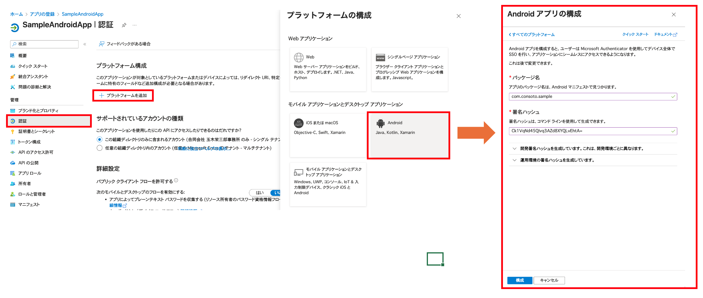
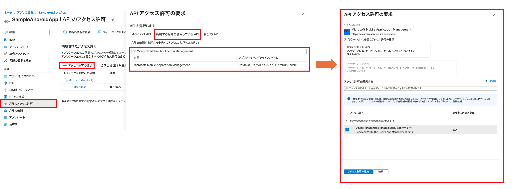
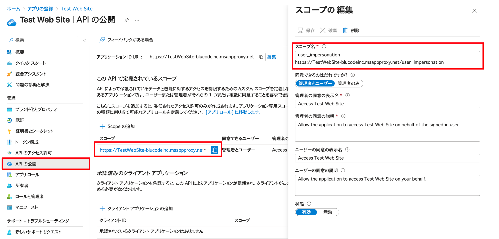
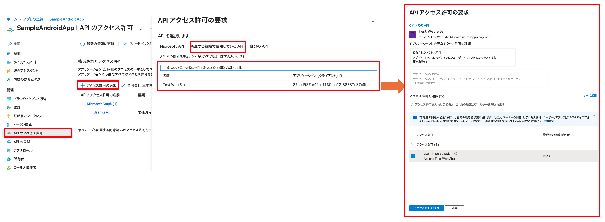
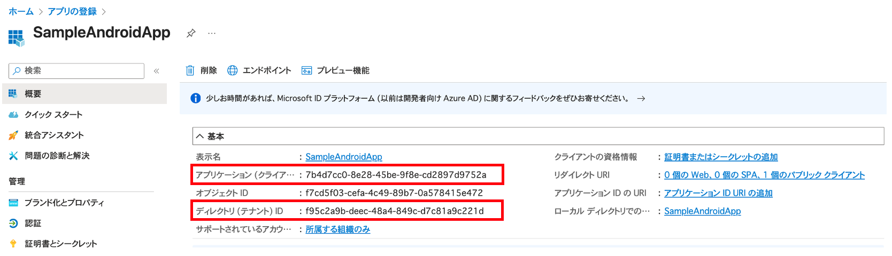
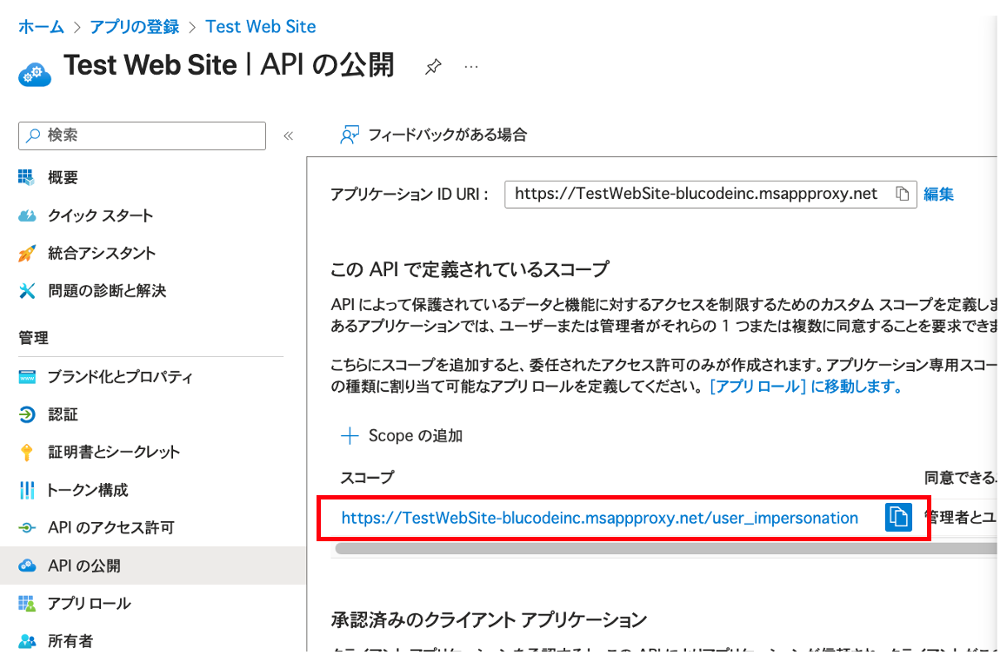

# EntraIDアプリケーション設定

- [EntraIDアプリケーション設定](#entraidアプリケーション設定)
  - [開発者から必要な情報を収集](#開発者から必要な情報を収集)
  - [EntraIDアプリケーション作成](#entraidアプリケーション作成)
  - [リダイレクトURIの追加](#リダイレクトuriの追加)
  - [APIのアクセス許可の追加](#apiのアクセス許可の追加)
    - [Microsoft Mobile Application Managementの検索](#microsoft-mobile-application-managementの検索)
    - [AppProxyのuser\_impersonationについて](#appproxyのuser_impersonationについて)
    - [AppProxyの検索方法](#appproxyの検索方法)
  - [開発者への情報提供](#開発者への情報提供)

## 開発者から必要な情報を収集

Androidアプリの設定に必要な以下の情報を開発者にご確認ください：

- **パッケージ名**
- **署名ハッシュ**

## EntraIDアプリケーション作成

Androidアプリに対応するEntraIDアプリケーションを作成します。

## リダイレクトURIの追加

提供いただいたパッケージ名と署名ハッシュを入力して、AndroidアプリのリダイレクトURIを登録します。

## APIのアクセス許可の追加

以下のアクセス許可を追加します：

- **Microsoft Mobile Application Management** の全て
- **AppProxy** の user_impersonation

### Microsoft Mobile Application Managementの検索
「Microsoft Mobile Application Management」と検索してください。

### AppProxyのuser_impersonationについて
AppProxyの新規作成時にデフォルトで公開されています。

### AppProxyの検索方法
AppProxyはクライアントIDまたは名前で検索できます。

## 開発者への情報提供

設定完了後、以下の情報を開発者の方にお伝えください：

**EntraIDアプリケーション**
- クライアントID
- テナントID

**AppProxy**
- user_impersonationのスコープ

