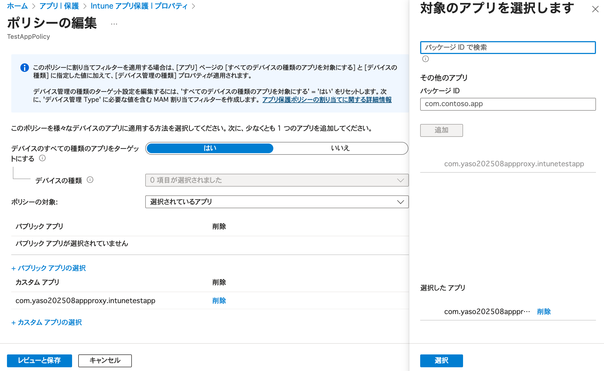
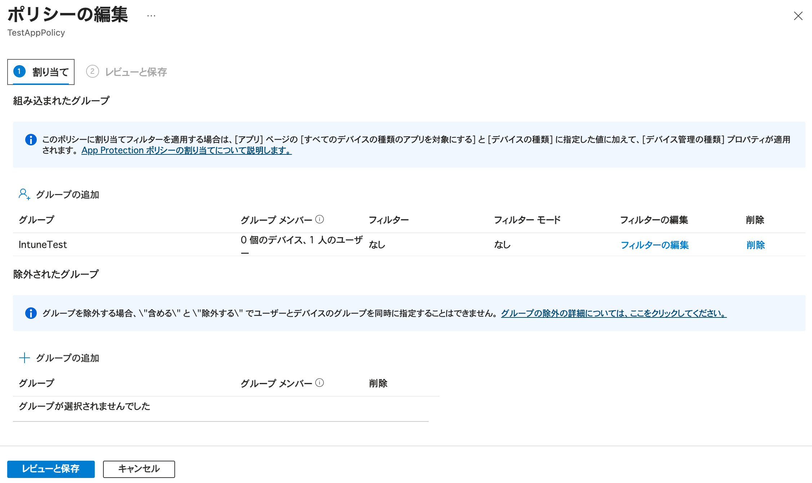

<!-- omit in toc -->
# Intuneアプリ保護ポリシーの適用

- [概要](#概要)
- [アプリ保護ポリシーの作成](#アプリ保護ポリシーの作成)
  - [対象アプリの指定](#対象アプリの指定)
  - [グループの割り当て](#グループの割り当て)

## 概要

AndroidアプリのWebViewからAppProxyへのアクセスを許可するため、Intuneアプリ保護ポリシーをAndroidアプリに適用します。

> **前提条件**: AppProxy条件付きアクセス許可設定で「アプリの保護ポリシーが必要」をONにしている場合に必要になります。

## アプリ保護ポリシーの作成

作成方法の詳細は[Microsoftドキュメント](https://learn.microsoft.com/ja-jp/intune/intune-service/apps/app-protection-policies)をご参照ください。

### 対象アプリの指定

「カスタムアプリの選択」で**パッケージID**を入力し、ポリシーを適用するAndroidアプリを指定します。

### グループの割り当て

ポリシーを適用する**グループ**（ユーザー、デバイスなど）を割り当てます。

> **注意**: 事前にグループを作成しておく必要があります。

