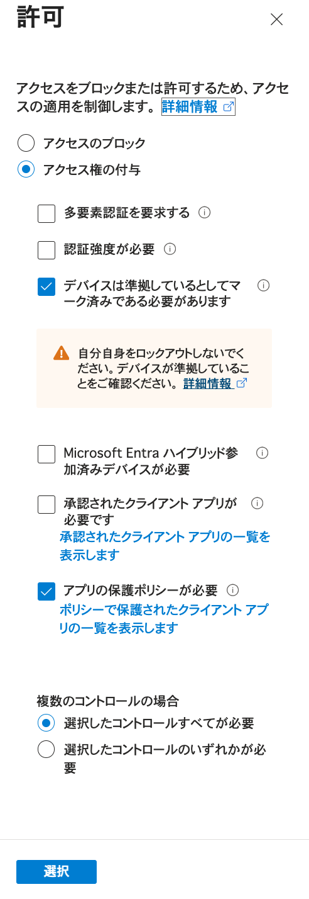

<!-- omit in toc -->
# AppProxy条件付きアクセス許可設定

- [設定項目](#設定項目)
- [AndroidアプリWebView向けの設定内容](#androidアプリwebview向けの設定内容)
  - [設定の注意点](#設定の注意点)
- [Intuneアプリ保護ポリシーについて](#intuneアプリ保護ポリシーについて)

## 設定項目

AppProxy条件付きアクセスには許可設定があり、以下の項目のON・OFFを設定できます。

- **デバイスは準拠しているとしてマーク済みである必要があります**
  - （以下、「デバイス準拠」と表記）
- **承認されたクライアントアプリが必要です**
  - （以下、「承認されたクライアントアプリ」と表記）
- **アプリの保護ポリシーが必要**
  - （以下、「アプリ保護ポリシー」と表記）

## AndroidアプリWebView向けの設定内容

AndroidアプリのWebViewからのアクセスを許可するには、以下の通り設定します。

| デバイス準拠 | 承認されたクライアントアプリ | アプリ保護ポリシー |
|:---:|:---:|:---:|
| ON | OFF | ON |

### 設定の注意点

- **承認されたクライアントアプリ：OFF**
  - ONにすると、WebViewからはアクセス不可になります。
- **デバイス準拠：ON**
  - OFFにすると、Intune管理外のAndroid端末からもアクセス可能になります。
- **アプリ保護ポリシー：ON**
  - OFFにすると、Chromeなど他のアプリからもアクセス可能になります。

## Intuneアプリ保護ポリシーについて

**アプリ保護ポリシー：ONの場合**

Androidアプリには以下が必要です：
- Intuneアプリ保護ポリシーの割り当て
- Intune App SDKの組み込み

**アプリ保護ポリシー：OFFの場合**

Androidアプリには以下が不要です：
- Intuneアプリ保護ポリシーの割り当て
- Intune App SDKの組み込み（不要の可能性があります）
